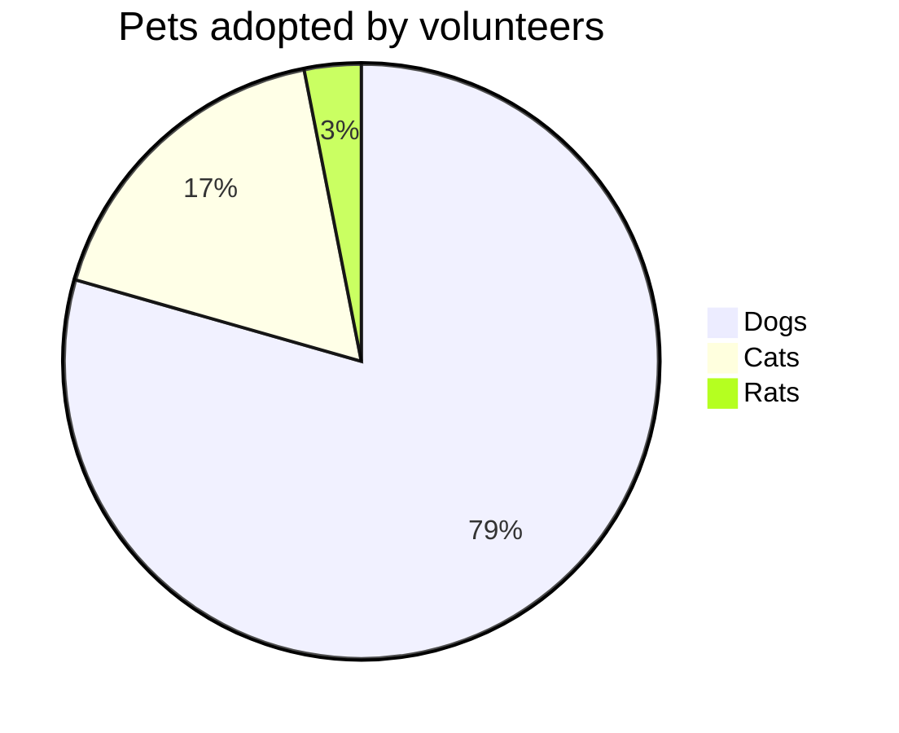

# multimodal_datasets

# 简介
本数据集多模态数据集。

# 数据集截图
  
  
  
  
  
  
  
  
  

# 场景分布

```mermaid
pie
数据场景分布
"室内聊天" : 386
"车载聊天" : 85
"室内访谈" : 15   
"视频会议" : 15   
"厨房" : 15   
"室外访谈" : 15   
"室外访谈" : 15   
```

```mermaid
pie
title Pets adopted by volunteers
"Dogs" : 386
"Cats" : 85
"Rats" : 15   
```
